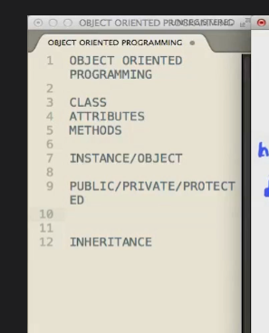
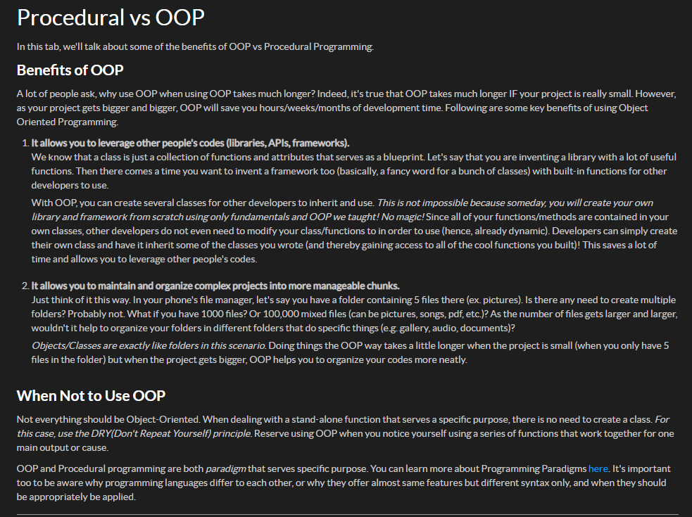

OOP Fundamentals

OOP (Object Oriented Programming) is something that has revolutionized how programming is done today. If you will compare from previous tracks, we used lots of functions (which is procedural way). Though functions can solve repetitive codes, there's another way we can save further. By using OOP correctly, it can save you loads of time and help you maintain codes easier, more effective than the procedural way.

Outline:
- Objects and Classes
- Class Structure
- Instantiation
- Properties
- Methods 
- Construct

- https://www.geeksforgeeks.org/introduction-of-programming-paradigms/

==========================================================================================================================
PHP created a **scope resolution operator (::)** to call the function from our parent class within the class we are overwriting.

==========================================================================================================================
Unit Testing in PHP
https://phpunitgen.io/docs#/en/