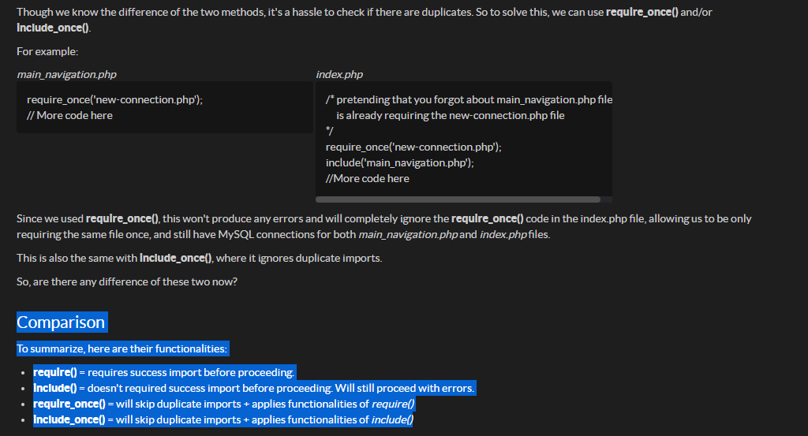

define('DB_HOST', 'localhost');
define('DB_USER', 'root');
define('DB_PASS', '');                              //set as 'root' if you're using Mac
define('DB_DATABASE', 'mydb');   //change value based on your existing database

$connection = new mysqli(DB_HOST, DB_USER, DB_PASS, DB_DATABASE);

================================================================================

The values declared above using define() are fixed/final and called as constants. Constants are like variables that can store, except they cannot change. In PHP, define() is used to create constants.

================================================================================

if($connection->connect_errno)
{
    die("Failed to connect to MySQL: (" . $connection->connect_errno . ") " . $connection->connect_error);
}

Remember before in jQuery, we used "dot" to do or access something from an element? Ex. $("h3").text();

Here in PHP, instead of dot, we used arrow -> symbol, which can also access something whether it is a function or not. In our case, we get connect_errno and connect_error from $connection variable. 

================================================================================

We'll find many cases where we will need to include a PHP script from one file in another file. This is fairly common and it happens with scripts that will be used on several different pages. Including a PHP script is nothing more than pasting the content of one file into another.

To help you in remembering their differences, let's talk about your understanding in basic English!

Imagine you're in MRT Station:

* From the word **require**, it will restrict you to enter if you do not have valid BEEP entry card!
* Then in the word **include**, you bring money but with expired BEEP entry card, thus you can still enter!

Technically, you'll most likely use **require** if you want to debug strictly and if some part of your application strongly relies into it. In the other hand, you can use **include** if you're okay proceeding with displayed errors because you're confident that your core application will still function as-is.

================================================================================

Duplicate-safe methods

================================================================================
**Built-in Functions**
1. mysqli_fetch_assoc()
- Fetches one row of data from the result set and returns it as an associative array. Each subsequent call to this function will return the next row within the result set, or null if there are no more rows.
